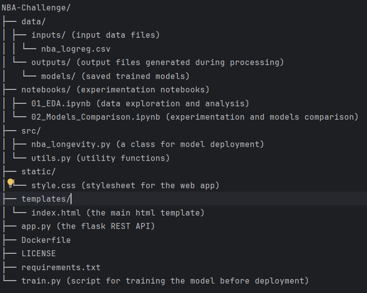
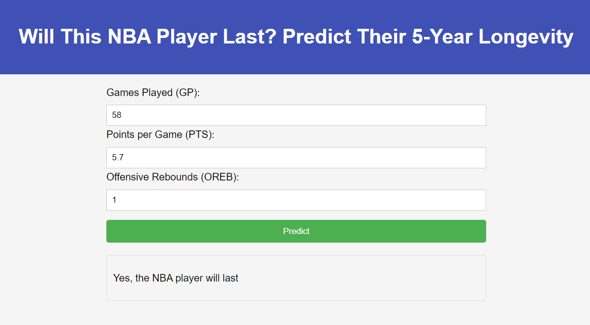

# NBA Player Longevity Prediction

This repository tackles a machine learning challenge: building a model to predict whether an NBA player, based on their
statistics, will last over 5 years in the league and whether they are worth investing in.

## Table of Contents

1. [Project Structure](#project-structure)
2. [Dataset Description](#dataset-description)
3. [Exploratory Data Analysis (EDA)](#exploratory-data-analysis-eda)
4. [Models Comparison](#models-comparison)
5. [Model Deployment (Simplified Prototype)](#model-deployment-simplified-prototype)
6. [Installation](#installation)
7. [Usage](#usage)
8. [License](#license)

## Project Structure

This project is organized into the following directories and files:



NBA-Challenge/
├── data/
│ ├── inputs/ (input data files)
│ │ └── nba_logreg.csv
│ └── outputs/ (output files generated during processing)
│ └── models/ (saved trained models)
├── notebooks/ (experimentation notebooks)
│ ├── 01_EDA.ipynb (data exploration and analysis)
│ └── 02_Models_Comparison.ipynb (experimentation and models comparison)
├── src/
│ ├── nba_longevity.py (a class for model deployment)
│ └── utils.py (utility functions)
├── static/
│ └── style.css (stylesheet for the web app)
├── templates/
│ └── index.html (the main HTML template)
├── app.py (the Flask REST API)
├── Dockerfile
├── LICENSE
├── requirements.txt
└── train.py (script for training the model before deployment)

## Dataset Description

The dataset contains various statistical features of NBA players. Here's a table summarizing the variables:

| Feature Name | Description                                                                                                                                 |
|--------------|---------------------------------------------------------------------------------------------------------------------------------------------|
| Name         | Player's name                                                                                                                               |
| GP           | Number of games played in the season                                                                                                        |
| MIN          | Minutes played per game (average)                                                                                                           |
| PTS          | Points scored per game (average)                                                                                                            |
| FGM          | Field successful goal attempts per game (average)                                                                                           |
| FGA          | Field goal attempts per game (average)                                                                                                      |
| FG%          | Field goal percentage (percentage of successful attempts per game)                                                                          |
| 3P Made      | Three-point shots made per game (average)                                                                                                   |
| 3PA          | Three-point shots attempted per game (average)                                                                                              |
| 3P%          | Three-point percentage (percentage of successful 3P per game)                                                                               |
| FTM          | Free throws made per game (average)                                                                                                         |
| FTA          | Free throw attempts per game (average)                                                                                                      |
| FT%          | Free throw percentage (percentage of successful FT per game)                                                                                |
| OREB         | Offensive rebounds per game (average): number of times the offensive player grabs the ball after a missed shot attempt by his team          |
| DREB         | Defensive rebounds per game (average): number of times the defending player grabs the ball after a missed shot attempt by the opposing team |
| REB          | Total rebounds per game (average): offensive rebounds plus defensive rebounds                                                               |
| AST          | Assists per game (average): number of passes made by the player that directly lead to a basket scored by a teammate                         |
| STL          | Steals per game (average) : number of times the player successfully takes the ball away from an opponent without fouling                    |
| BLK          | Blocks per game (average) : number of times the player deflects a shot attempt made by an opposing player                                   |
| TOV          | Turnovers per game (average): number of times the player loses possession of the ball due to a mistake or being stripped by an opponent     |
| TARGET 5Yrs  | Binary variable indicating playing for at least 5 years (1) or less (0)                                                                     |

**Note:**

* Field goal percentage (FG%) is calculated as FGM / FGA.
* Three-point percentage (3P%) is calculated as 3P Made / 3PA.
* Free throw percentage (FT%) is calculated as FTM / FTA.
* Total rebounds (REB) is calculated as OREB + DREB.
* Games played (GP) and minutes played (MIN) are restricted to realistic values (GP <= 82, MIN <= 42).

This table provides a quick overview of the data available in [nba_logreg.csv](./data/inputs/nba_logreg.csv).

## Exploratory Data Analysis (EDA)

We provided a comprehensive Exploratory Data Analysis (EDA) of the NBA player statistics dataset. The analysis is
documented in a [Jupyter Notebook](./notebooks/01_EDA.ipynb), providing insights into various data aspects.
In addition to the notebook, a detailed report summarizing the key findings of the EDA is available as
an [HTML file](./data/outputs/nba_player_report.html). This report offers a concise overview of the data's
characteristics and potential cleaning steps.

## Models comparison

Building upon the insights from the [EDA](./notebooks/01_EDA.ipynb), we further explored the data's potential for
prediction. We compared several machine learning methods in a
separate [notebook](./notebooks/02_Models_Comparison.ipynb) including Logistic Regression, SVC, Random Forest, Gradient
Boosting, XGBoost, and MLP.

In this comparison, we prioritized precision as a key metric. This is because we aimed to minimize the risk of false
positives, which could mislead investors. It's important to note that we didn't push the models to their absolute
limits, as our primary objective wasn't solely achieving the highest performances.

If our primary objective were improving performance, we would add more features to the data, such as:

| Feature Name                     | Description                                                                                             |
|----------------------------------|---------------------------------------------------------------------------------------------------------|
| Age                              | The age of the player at the time of prediction.                                                        |
| Player Efficiency Rating (PER)   | A metric that summarizes all aspects of a player's on-court production into a single number.            |
| Win Share (WS)                   | Estimates a player's contribution to their team winning games.                                          |
| Games Played (GP) Last Season    | The number of games played by the player in the previous season. Can be an indicator of injury history. |
| Number/Severity of Past Injuries | Information on past injuries and the impact they had on playing time.                                   |

## Model Deployment (Simplified Prototype)

We've deployed a simplified Flask application with a REST API for user interaction. This API allows users to submit
player statistics, and the model running in the backend predicts whether the player is likely to remain in the NBA after
5 years.

To balance user experience and model performance, we've carefully selected a subset of features that are both
informative and easy for users to provide.



## Installation

This project requires Python 3.11 or later. Here are two options for setting up the environment:

**1. Using a Virtual Environment (Recommended):**

* **Prerequisites:**
    * Ensure you have `python3.11` or later installed. You can verify this by running `python3 --version` in your
      terminal.

* **Steps:**

    1. Create a virtual environment using `venv` or `virtualenv`:

        ```bash
        python3 -m venv venv  # Using venv module
        # OR
        virtualenv venv        # Using virtualenv package (install with pip)
        ```

    2. Activate the virtual environment:

        ```bash
        source venv/bin/activate  # Linux/macOS
        # OR
        venv\Scripts\activate.bat  # Windows
        ```

    3. Install project dependencies from `requirements.txt`:

        ```bash
        pip install -r requirements.txt
        ```

**2. Using Docker (Optional):**

This project also provides a `Dockerfile` for building a containerized environment.

* **Prerequisites:**

    * Docker installed on your system.

* **Build the Docker image:**

    ```bash
    docker build -t nba_longevity_predictor .
    ```

## Usage

This section provides instructions on deploying the model and running the Flask application for user interaction.

1. **Train the Model:**
   Before deploying the model, ensure it is trained on the provided data. Activate your virtual environment (if using
   one) and run the following command:

   ```bash
   python3 train.py --data_path ./data/inputs/nba_logreg.csv

2. **Running the Flask App:**
   You have two options for running the Flask application:
    - Using a Virtual Environment:
   ```bash
   python3 app.py
   ```
    - Using Docker (Recommended):
   ```bash
   docker run --rm -it nba_longevity_predictor
   ```

## License

This project is licensed under the BSD 2-Clause License. See the [LICENSE](LICENSE) file for details.

Feel free to copy and paste this content into your README.md file. Adjust any paths or details as needed for your
specific project setup.
